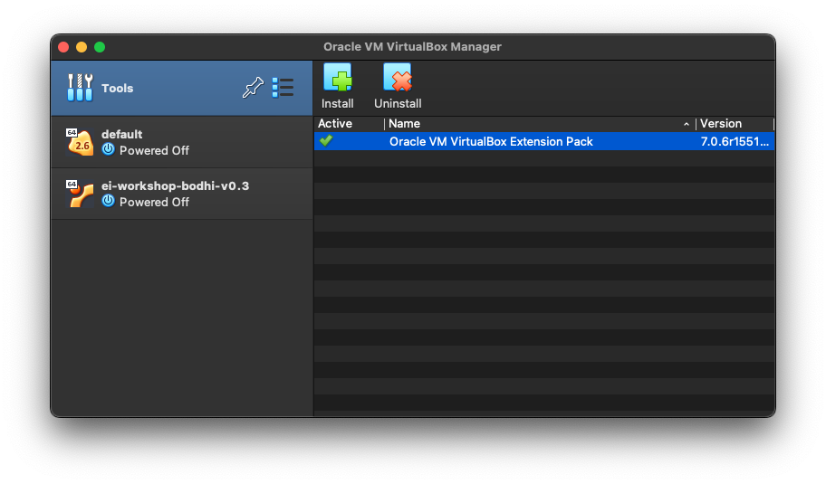
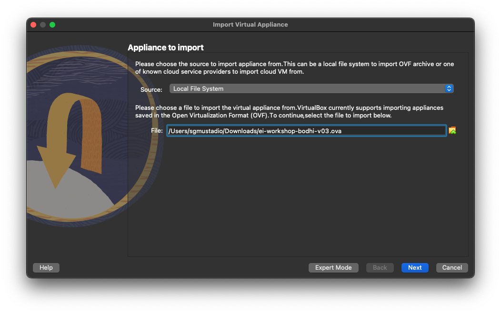
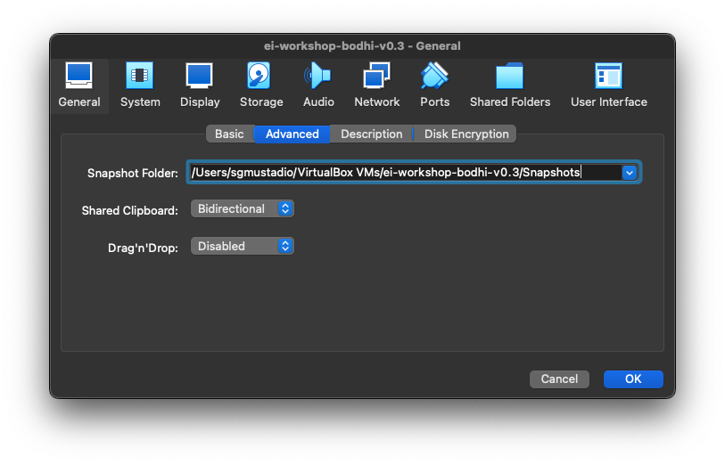
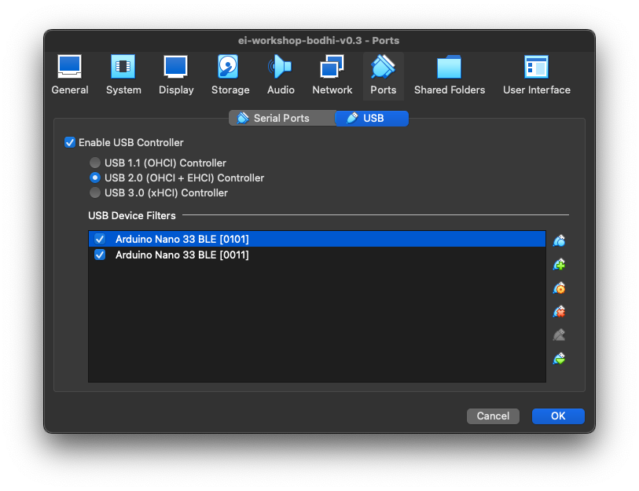

# Edge Impulse Workshop Virtual Machine

This virtual machine (VM) was constructed to alleviate toolchain installation issues across multiple operating systems during live workshops. It contains any necessary tools and development environments required, or it offers an easy path to install such tools in a standardized manner.

## Getting started

### Install VirtualBox and Extension Pack

Install VirtualBox for your operating system: [www.virtualbox.org/wiki/Downloads](https://www.virtualbox.org/wiki/Downloads)

Download the VirtualBox Extension Pack: [www.virtualbox.org/wiki/Downloads](https://www.virtualbox.org/wiki/Downloads)

Open VirtualBox. 

> IMPORTANT! If you are on Linux or macOS, start VirtualBox with administrative privileges: `sudo virtualbox`. We need to do this to allow for USB passthrough (see [this post](https://forums.virtualbox.org/viewtopic.php?f=8&t=107333#p527198) to learn more).

Go to **Tools > Extensions**. Click **Install** and select the *.vbox-extpack* you just downloaded. Click **Install**  and agree to the license if asked.

### Import VM

Download the latest EI Workshop VM image: [EI Workshop VM v0.4](https://drive.google.com/file/d/1Xm6Yj8gR2sYDTX9afeOesxYIy4GS4dDg/view?usp=sharing)

Open VirtualBox. Select **File > Import Appliance**. Select the downloaded .ova file.

Click **Next**. Leave all the default import settings and click **Finish**.

### Configure clipboard

If you would like to be able to copy and paste text between your host machine and VM, click on the imported VM on the left pane. Select **Settings**. Click **General** and go to the **Advanced** tab.

Change *Shared Clipboard* to **Bidirectional**.

Click **OK**.

### Configure USB passthrough

Click on the imported VM on the left pane. Select **Settings**. Select **USB** (*Ports > USB* on macOS) and ensure that *Enable USB Contrller* is checked with *USB 2.0 (OHCI + EHCI) Controller* selected.

Plug in your development board to your computer.

Click the **Add new USB filter** button on the right side of the window. Select your development board. The board should appear in the *USB Device Filters* pane.

If your board has a bootloader mode, put the board into bootloader mode and repeat the above process. You should see two separate entries in the filters pane: one for your board in regular operation mode and another for your board in bootloader mode.

Click **OK**.

### Start VM

Select the VM on the left pane and click *Start*!

## License

The virtual machine image is built using [Bodhi Linux](https://www.bodhilinux.com/), which mostly uses [GPL](https://www.gnu.org/licenses/gpl-3.0.en.html).

This (admittedly very short) guide is licensed under [CC BY 4.0](https://creativecommons.org/licenses/by/4.0/).